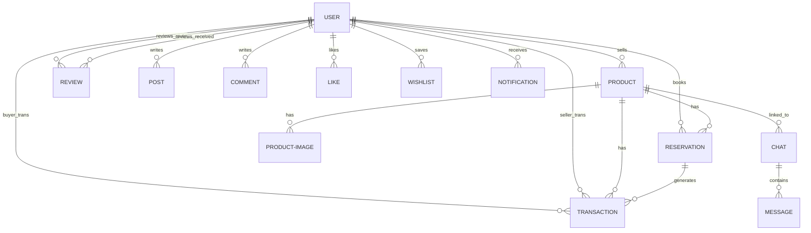

# Analisis Komprehensif Codebase Lapak UI

Dokumen ini menyajikan analisis mendalam terhadap seluruh struktur direktori, file konfigurasi, model basis data, utilitas core, halaman UI, dan endpoint API dalam proyek **Lapak UI** (Marketplace & Community Platform for UI Students). Analisis ini didasarkan pada pemeriksaan langsung terhadap file-file dalam workspace, membandingkannya dengan Product Requirements Document (PRD) yang terdapat pada [lapak-ui.md](file:///c:/Github/lapak-ui/lapak-ui.md).

---

## 📂 1. Peta Struktur Direktori & Organisasi File

Proyek Lapak UI menggunakan arsitektur modern **Next.js 16 (App Router)** yang terintegrasi dengan **Prisma ORM v7** dan **TailwindCSS v4**. Kode diorganisasikan dengan sangat rapi ke dalam beberapa folder utama:

```mermaid
graph TD
    Root[lapak-ui/] --> App[app/]
    Root --> Components[components/]
    Root --> Lib[lib/]
    Root --> Prisma[prisma/]
    Root --> Types[types/]
    Root --> Configs[File Konfigurasi]

    App --> Admin[admin/ - Portal Moderasi]
    App --> API[api/ - Endpoint RESTful]
    App --> Auth[login/ & register/ - Sesi]
    App --> Market[marketplace/ - Katalog & Detail]
    App --> ResTrans[reservations/ & transactions/ - Alur COD]
    App --> Chat[chat/ - Chat Room]
    App --> Comm[community/ - Forum Kampus]
    App --> SubPages[dashboard/, notifications/, wishlist/, profile/]

    Lib --> LibAuth[auth.ts - Sesi & Password]
    Lib --> LibAPI[api.ts - Helper Auth & Response]
    Lib --> LibPrisma[prisma.ts - Singleton Client]

    Prisma --> Schema[schema.prisma - Desain Skema]
```



---

## 🛠️ 2. Analisis Konfigurasi Root & Dependensi (`package.json`)

Berikut adalah analisis dari file konfigurasi utama di direktori root:

| File | Peran & Deskripsi Teknis |
|---|---|
| **[package.json](file:///c:/Github/lapak-ui/package.json)** | Menggunakan **Next.js 16.2.5 (React 19)** sebagai framework inti, **Prisma 7.8.0** untuk ORM, serta **Tailwind CSS v4** untuk styling premium. Dependensi autentikasi menggunakan `bcryptjs` (hashing) dan `jose` & `jsonwebtoken` (JWT). |
| **[next.config.ts](file:///c:/Github/lapak-ui/next.config.ts)** | Mengatur parameter build Next.js. Karena menggunakan App Router modern, konfigurasi dioptimalkan untuk performa tinggi. |
| **[prisma.config.ts](file:///c:/Github/lapak-ui/prisma.config.ts)** | Berkas penunjang untuk kustomisasi generator prisma dalam modul Next.js. |
| **[tsconfig.json](file:///c:/Github/lapak-ui/tsconfig.json)** | Mengatur *TypeScript compiler options*, termasuk konfigurasi alias `@/*` untuk pemetaan folder ke `src` atau root `app` agar impor file lebih bersih. |
| **[eslint.config.mjs](file:///c:/Github/lapak-ui/eslint.config.mjs)** | Aturan linter modern Next.js untuk menjaga konsistensi gaya penulisan kode TypeScript. |
| **[postcss.config.mjs](file:///c:/Github/lapak-ui/postcss.config.mjs)** | Integrasi PostCSS dengan `@tailwindcss/postcss` untuk pemrosesan build styling CSS. |
| **[.env](file:///c:/Github/lapak-ui/.env)** & **[.env.local](file:///c:/Github/lapak-ui/.env.local)** | Menyimpan variabel lingkungan sensitif seperti koneksi database PostgreSQL (`DATABASE_URL`) dan kunci enkripsi JWT (`JWT_SECRET`). |

---

## 🗄️ 3. Arsitektur Basis Data (`prisma/schema.prisma`)

Skema database yang didefinisikan dalam **[schema.prisma](file:///c:/Github/lapak-ui/prisma/schema.prisma)** mencakup **13 entitas** yang sangat terorganisasi dan dinormalisasi dengan baik (menggunakan relasi relasional PostgreSQL secara optimal):



### Analisis Teknis Model Prisma:
1. **`User` (Tabel `users`)**: Menyimpan profil dasar mahasiswa UI.
   - Kolom penunjang: `faculty`, `profilePicture`, `ratingAvg` (Decimal 3,2), `ratingCount`, dan bendera suspensi `isActive`.
   - Integrasi eksternal: Kolom `telegramChatId` (BigInt) untuk notifikasi Telegram Bot dan `googleCalendarToken` untuk sinkronisasi jadwal COD ke Google Calendar.
2. **`Product` (Tabel `products`)**: Menyimpan listing barang/jasa.
   - Status terdefinisi (`status`): `available`, `reserved`, `on_progress`, `completed`, `cancelled`.
   - Mendukung tipe `category` ('barang'/'jasa'), `condition`, `reservationDuration` (timer manual), dan pelacakan interaksi via `viewCount`.
3. **`Reservation` (Tabel `reservations`)**: Mengatur proses booking barang.
   - Menggunakan kolom `expiresAt` (zona waktu lengkap/Timestamptz) dan kolom string `redisKey` untuk koordinasi timer otomatis.
4. **`Transaction` (Tabel `transactions`)**: Riwayat transaksi pasca-reservasi disetujui.
   - Mengimplementasikan alur konfirmasi ganda (*Double Confirmation*): `sellerConfirmedAt` dan `buyerConfirmedAt`.
   - Mengintegrasikan penjadwalan via `codScheduledAt` dan `codLocation`.
5. **`Review` (Tabel `reviews`)**: Reputasi seller. Menghubungkan transaksi dengan reviewer (`reviewerId`) dan reviewee (`revieweeId`) dengan rentang rating 1-5 bintang.
6. **`Post`, `PostImage`, `Comment`, `Like`**: Ekosistem social layer komunitas kampus yang saling berelasi secara erat.
7. **`Chat`, `Message`**: Struktur pesan instan. Kamar chat (`Chat`) mengikat `productId` (product-linked chat) sehingga proses tawar-menawar menjadi sangat terfokus.
8. **`Wishlist`**: Bookmark personal produk favorit menggunakan indeks unik gabungan (`@@unique([userId, productId])`).
9. **`Notification`**: Peringatan in-app multiproduk (`type`, `title`, `message`, `link`, `isRead`).

---

## ⚡ 4. Analisis Lapisan Core & Keamanan (`lib/` & `middleware`)

Aplikasi Lapak UI mengimplementasikan lapisan utilitas berkinerja tinggi untuk autentikasi, API response, dan database instance:

### A. Autentikasi & Sesi Sesi (`lib/auth.ts`)
*   **Hashing Password**: Menggunakan `bcryptjs` dengan kekuatan salt round 12 (`hashPassword` dan `verifyPassword`).
*   **Sesi Stateless JWT**: Menggunakan library modern `jose` untuk membuat token sesi JWT (`createSession` & `verifySession`) dengan masa kedaluwarsa 7 hari.
*   **Keamanan Cookie**: Token disimpan menggunakan cookie aman (`lapak_session`):
    *   `httpOnly: true` (mencegah pencurian token lewat skrip XSS).
    *   `secure: true` pada mode produksi (transmisi wajib HTTPS).
    *   `sameSite: 'strict'` (perlindungan penuh terhadap serangan CSRF).
    *   `path: '/'` (sesi tersedia di seluruh rute halaman).

### B. Proteksi Jalur Pengguna (`middleware.ts`)
Middleware bertindak sebagai gerbang keamanan pada tingkat edge:
*   **`PROTECTED_ROUTES`**: Memproteksi seluruh rute internal (`/dashboard`, `/sell`, `/community`, `/chat`, dll.). Jika user belum login, mereka akan diarahkan secara otomatis ke `/login` dengan menyimpan rute asal sebagai parameter `redirect` (UX premium).
*   **`ADMIN_ROUTES`**: Membatasi akses rute `/admin` hanya untuk akun yang memiliki `role === 'admin'`. Jika pengguna biasa mencoba mengakses, mereka akan dialihkan ke `/dashboard`.
*   **`AUTH_ROUTES`**: Jika pengguna yang sudah login mencoba mengakses rute `/login` atau `/register`, mereka secara otomatis akan dipindahkan ke `/dashboard` (mencegah form submission ganda).

### C. Helper API & Pembatas (`lib/api.ts`)
*   Menyediakan fungsi terstandarisasi untuk memotong boilerplates penulisan router Next.js:
    *   `requireAuth()`: Memvalidasi sesi dan langsung melempar respons JSON `401 Unauthorized` jika tidak valid.
    *   `requireAdmin()`: Memvalidasi role admin dan melempar respons JSON `403 Forbidden` jika pengguna tidak memiliki izin akses.
    *   `ok(data, status)` & `err(message, status)`: Membungkus objek data dan pesan kesalahan ke dalam format standar `NextResponse.json` secara ringkas.

### D. Singleton DB Connection (`lib/prisma.ts`)
*   Menggunakan pola desain singleton untuk mencegah menumpuknya koneksi database aktif selama proses *hot-reload* di lingkungan pengembangan lokal Next.js. Prisma Client disimpan di dalam variabel global jika aplikasi berjalan di luar lingkungan produksi.

---

## 🌐 5. Analisis Endpoint API Backend (`app/api/`)

Struktur endpoint API Lapak UI menggunakan pendekatan RESTful yang terstandarisasi tinggi. Berikut adalah analisis pembagian fungsionalitas backend:

### A. Modul Autentikasi (`api/auth/`)
*   **[login/route.ts](file:///c:/Github/lapak-ui/app/api/auth/login/route.ts)**: Membaca email & password, memverifikasi hash bcrypt, menghasilkan JWT, dan mengeset cookie sesi.
*   **[register/route.ts](file:///c:/Github/lapak-ui/app/api/auth/register/route.ts)**: Menerima pembuatan akun baru, memvalidasi aturan karakter nama (2-100), memastikan keunikan email, dan mengenkripsi password sebelum disimpan ke database.
*   **[logout/route.ts](file:///c:/Github/lapak-ui/app/api/auth/logout/route.ts)**: Menghapus cookie `lapak_session` dari browser.
*   **[me/route.ts](file:///c:/Github/lapak-ui/app/api/auth/me/route.ts)**: Menampilkan profil sesi aktif pengguna yang sedang login.

### B. Modul Marketplace (`api/products/`)
*   **[route.ts](file:///c:/Github/lapak-ui/app/api/products/route.ts)**:
    *   **`GET`**: Menyediakan pencarian (search) dan penyaringan (filters) yang sangat komprehensif (kategori, subkategori, rentang harga, lokasi fakultas, status ketersediaan) yang dilengkapi dengan pagination serta sorting (terbaru, termurah, termahal).
    *   **`POST`**: Membuat produk/jasa baru dan menyimpan beberapa gambar sekaligus secara sekuensial.
*   **[my/route.ts](file:///c:/Github/lapak-ui/app/api/products/my/route.ts)**: Menampilkan produk yang dipublikasikan oleh seller aktif.
*   **[[id]/route.ts](file:///c:/Github/lapak-ui/app/api/products/[id]/route.ts)**: Mengatur detail produk individu, termasuk fungsi `PUT` untuk penyuntingan dan `DELETE` untuk penghapusan listing produk.

### C. Sistem Reservasi & Alur COD (`api/reservations/` & `api/transactions/`)
*   **[reservations/route.ts](file:///c:/Github/lapak-ui/app/api/reservations/route.ts)**: Mengatur aksi pembuatan booking produk.
    *   *Temuan Menarik*: Endpoint ini menghitung waktu kedaluwarsa reservasi (`expiresAt`) sesuai dengan durasi yang disetel seller dan membuat format string `redisKey` (`reservation:${productId}:${session.userId}`). Namun, pada kode saat ini, **tidak ada library Redis (seperti `@upstash/redis` or `ioredis`) yang dipanggil**. Alur kedaluwarsa saat ini masih disimpan murni secara pasif di dalam database relasional.
*   **[reservations/[id]/[action]/route.ts](file:///c:/Github/lapak-ui/app/api/reservations/[id]/[action]/route.ts)**: Mengatur aksi transisi status reservasi:
    *   `accept`: Mengubah status reservasi menjadi `accepted`, merubah ketersediaan produk menjadi `on_progress`, memicu pembuatan entitas `Transaction` baru, dan mengirimkan in-app notification ke buyer.
    *   `reject`: Mengembalikan status produk menjadi `available`.
    *   `cancel`: Membatalkan reservasi aktif.
*   **[transactions/[id]/[action]/route.ts](file:///c:/Github/lapak-ui/app/api/transactions/[id]/[action]/route.ts)**: Mengatur transisi konfirmasi transaksi ganda:
    *   `seller-confirm`: Mengubah status ke `waiting_buyer_confirm` dan memberi tahu buyer untuk melakukan konfirmasi penyelesaian COD.
    *   `buyer-confirm`: Mengubah status final transaksi ke `completed`, mengubah status produk ke `completed` (terjual), dan membuka akses form rating.
    *   `cod-schedule`: Melakukan pembaruan kesepakatan lokasi COD dan jadwal temu.

### D. Fitur Komunitas Sosial & Interaksi (`api/posts/`, `api/chats/`, `api/notifications/`, `api/reviews/`, `api/wishlist/`)
*   **Posts & Comments**: Mengatur penerbitan postingan sosial kampus, penyematan banyak gambar, pembuatan komentar thread, serta penambahan likes secara unik per pengguna.
*   **Chats & Messages**: Mengelola daftar obrolan aktif dan merekam pesan yang dikirimkan. Di dalam `schema.prisma` terdapat entitas Chat, namun pada implementasi database, pesan-pesan ini disimpan secara terstruktur di PostgreSQL.
*   **Notifications**: Memungkinkan fetch daftar peringatan in-app milik pengguna, menandai status baca individual (`/[id]/read`), atau melakukan pembersihan notifikasi sekaligus (`/read-all`).
*   **Reviews**: Merekam rating (1-5) dan testimoni ulasan pasca COD selesai, serta memperbarui kalkulasi rata-rata (`ratingAvg`) pada profil seller bersangkutan.
*   **Wishlists**: Mengelola penyimpanan bookmark katalog produk favorit.
*   **Profile**: Mengatur penyuntingan profil pengguna aktif (nama, fakultas, foto profil, tautan media sosial/telegram).

---

## 🎨 6. Analisis Halaman UI & Pengalaman Pengguna (UX)

Sistem antarmuka Lapak UI dibuat dengan filosofi **Apple-grade minimalist** dengan fondasi monokromatis dan kuning sebagai warna aksen sakral (`#FBDA00`).

```
Kuning (#FBDA00)  --> Hanya digunakan pada CTA primer, highlight harga, & badge status aktif.
Dasar Monokrom   --> Background putih bersih, elemen abu-abu halus (#F5F5F5), teks hitam legam.
Transisi Halus   --> Durasi transisi 200ms ease dengan sudut tumpul rounded-3xl yang premium.
```

Berikut adalah rincian fungsionalitas halaman-halaman utama dalam aplikasi:

### A. Halaman Publik & Katalog Utama
*   **[Landing Page (app/page.tsx)](file:///c:/Github/lapak-ui/app/page.tsx)**: Desain mewah dengan animasi halus, badge khusus mahasiswa UI, visualisasi statistik platform (2,000+ mahasiswa aktif, 500+ produk, 14 fakultas), dan CTA raksasa dengan bayangan halus untuk navigasi terarah.
*   **[Katalog (app/marketplace/page.tsx)](file:///c:/Github/lapak-ui/app/marketplace/page.tsx)**: Pusat pencarian barang bekas dan jasa. Dilengkapi tombol filter responsif di bagian atas untuk menyaring jenis kategori (barang vs jasa), rentang harga, lokasi fakultas, dan sorting.
*   **[Detail Produk (app/marketplace/[id]/page.tsx)](file:///c:/Github/lapak-ui/app/marketplace/[id]/page.tsx)**: Menampilkan carousel gambar produk, spesifikasi kondisi barang, durasi sisa reservasi, rincian lokasi COD, dan profil lengkap seller beserta rata-rata reputasinya. Halaman ini dibentuk menggunakan kombinasi:
    *   **Server Component**: Membaca data langsung dari database secara aman dan melacak peningkatan jumlah penayangan (`viewCount`).
    *   **Client Components**: Menyematkan tombol interaktif seperti **`ReserveButton`**, **`WishlistButton`**, dan **`ChatButton`** untuk interaksi instan tanpa membebani muat halaman awal.

### B. Halaman Transaksi & Sesi Pengguna
*   **[Dashboard Utama (app/dashboard/page.tsx)](file:///c:/Github/lapak-ui/app/dashboard/page.tsx)**: Gerbang utama bagi pengguna yang sudah login. Menyajikan statistik ringkas performa pengguna (jumlah jualan aktif, reservasi masuk, postingan komunitas, reputasi profil) beserta daftar aksi cepat (*Quick Actions*) dalam tata letak kisi (grid layout) yang responsif dan rapi.
*   **[Pengelolaan Produk Saya (app/my-products/page.tsx)](file:///c:/Github/lapak-ui/app/my-products/page.tsx)**: Panel inventaris penjual untuk mengaktifkan, mengedit, atau menghapus postingan barang.
*   **[Reservasi Saya (app/reservations/outgoing/page.tsx) & Reservasi Masuk (app/reservations/incoming/page.tsx)](file:///c:/Github/lapak-ui/app/reservations/)**: Antarmuka kontrol bagi buyer dan seller untuk memproses persetujuan atau pembatalan reservasi COD yang sedang aktif.
*   **[Detail Transaksi (app/transactions/[id]/page.tsx)](file:///c:/Github/lapak-ui/app/transactions/[id]/page.tsx)**: Panel koordinasi COD yang memandu pengguna melalui tahap kesepakatan waktu, lokasi, konfirmasi selesai dari seller, konfirmasi selesai dari buyer, hingga pengisian ulasan bintang secara mulus.

### C. Kamar Obrolan, Notifikasi, & Komunitas Kampus
*   **[Forum Komunitas (app/community/page.tsx)](file:///c:/Github/lapak-ui/app/community/page.tsx)**: Feed interaktif kampus yang bersih (terinspirasi dari platform micro-blogging modern) untuk saling berbagi rekomendasi atau info transaksi.
*   **[Chat Room (app/chat/page.tsx) & (app/chat/[id]/page.tsx)](file:///c:/Github/lapak-ui/app/chat/)**: Halaman obrolan langsung untuk negosiasi COD yang terikat langsung dengan listing barang/jasa bersangkutan.
*   **[Notifikasi (app/notifications/page.tsx)](file:///c:/Github/lapak-ui/app/notifications/page.tsx)**: Pusat pemberitahuan in-app yang disusun secara kronologis dengan pemisahan ikon visual untuk tiap jenis event.

---

## 🔍 7. Temuan Penting, Celah Implementasi & Rekomendasi

Meskipun sistem dasar database, API, dan halaman UI utama telah dibangun dengan sangat solid, terdapat beberapa celah arsitektur penting yang perlu segera diperbaiki agar aplikasi ini siap digunakan pada skala produksi (*production-ready*):

### 🧠 Celah 1: Integrasi Redis Timer Belum Aktif
*   **Analisis**: Pada [schema.prisma](file:///c:/Github/lapak-ui/prisma/schema.prisma) terdapat field `redisKey` dan pada endpoint [reservations/route.ts](file:///c:/Github/lapak-ui/app/api/reservations/route.ts) string key ini telah digenerate. Namun, **tidak ada kode koneksi Redis yang diimplementasikan**. Sesi penghapusan reservasi kedaluwarsa secara otomatis (TTL) belum berjalan secara aktif.
*   **Dampak**: Status produk yang di-reserve (`RESERVED`) akan terkunci selamanya jika seller/buyer bersangkutan bersikap pasif, karena tidak ada sistem background worker atau TTL Redis yang mengembalikannya ke status `AVAILABLE`.
*   **Solusi**:
    1.  Instal library Upstash Redis: `npm install @upstash/redis` (atau `ioredis`).
    2.  Buat berkas client Redis di `lib/redis.ts`.
    3.  Pada saat reservasi dibuat (`POST /api/reservations`), set key di Redis dengan TTL sesuai durasi reservasi: `await redis.set(redisKey, reservation.id, { ex: durationInSeconds })`.
    4.  Gunakan **Upstash Redis Webhooks** atau buat endpoint cron job `/api/cron/reservations-checker` di Next.js (yang dipicu setiap 5-15 menit menggunakan Vercel Cron) untuk memindai database dan membatalkan reservasi yang waktu `expiresAt`-nya telah terlampaui namun masih berstatus `pending`.

### 📳 Celah 2: Dynamic State pada Navbar Umum (`components/Navbar.tsx`)
*   **Analisis**: Berkas [Navbar.tsx](file:///c:/Github/lapak-ui/components/Navbar.tsx) saat ini bertipe statis dan selalu menampilkan tombol "Masuk" dan "Daftar". Navbar ini belum mendeteksi status login aktif pengguna.
*   **Dampak**: Pengguna yang sudah masuk ke dashboard atau halaman katalog tetap melihat tombol "Masuk"/"Daftar" di sudut kanan atas navbar umum, yang merusak ilusi integrasi sesi sistem.
*   **Solusi**: Ubah navbar menjadi dinamis dengan memeriksa sesi cookie secara asinkron atau buat pembungkus Server Component untuk membaca sesi pengguna aktif sebelum merender navbar:
    ```tsx
    import { getSessionFromCookie } from "@/lib/auth";
    // ... di dalam komponen Navbar ...
    const session = await getSessionFromCookie();
    // Jika ada session, tampilkan menu Dashboard & Profile Avatar.
    // Jika null, tampilkan tombol Masuk & Daftar.
    ```

### 💬 Celah 3: Sinkronisasi Pesan Realtime Chat
*   **Analisis**: Skema database dirancang untuk mendukung interaksi pesan secara langsung (`Chat` dan `Message`), namun backend API saat ini masih berbasis penulisan/pembacaan database standar secara berkala (*HTTP Polling*).
*   **Dampak**: Pengguna harus me-refresh halaman chat atau sistem harus melakukan polling HTTP secara terus-menerus untuk mendeteksi adanya pesan baru, yang dapat membebani kapasitas database PostgreSQL secara drastis.
*   **Solusi**: Integrasikan **Supabase Realtime** atau gunakan **Pusher** sebagai WebSocket manager ringan agar pengiriman pesan dapat langsung didistribusikan ke layar pengguna secara instan (*realtime push notification*).

### 📧 Celah 4: Multi-Channel Notifications (Telegram, Email, Calendar)
*   **Analisis**: Model database `User` sudah menyiapkan kolom `telegramChatId` dan `googleCalendarToken`. Namun, fungsionalitas pengiriman email via Resend, bot Telegram, maupun integrasi API Google Calendar belum diimplementasikan aktif di dalam rute-rute transaksi.
*   **Solusi**:
    1.  **Email (Resend)**: Buat berkas `lib/email.ts` menggunakan library `resend` untuk mengirimkan ringkasan reservasi penting.
    2.  **Telegram Bot**: Manfaatkan `fetch` langsung ke Telegram Bot API (`https://api.telegram.org/bot<TOKEN>/sendMessage`) untuk mendorong pesan notifikasi instan saat produk terjual.
    3.  **Google Calendar**: Integrasikan Google OAuth pada profil user agar sistem dapat otomatis menambahkan agenda janji temu COD ke Google Calendar masing-masing pengguna.

---

## 💎 Kesimpulan Akhir

Arsitektur dasar proyek **Lapak UI** sangatlah **premium dan luar biasa**. Desain antarmuka monokrom dengan aksen kuning khas FTUI memberikan visualisasi yang bersih, modern, dan fungsional (Apple-grade). Normalisasi database relasional pada skema Prisma juga sangat matang dan siap menampung relasi data yang kompleks. 

Dengan menyempurnakan celah integrasi (khususnya mengaktifkan sistem timer otomatis pada reservasi menggunakan kombinasi database/cron, serta membuat Navbar menjadi dinamis berbasis sesi pengguna), Lapak UI akan menjadi aplikasi portofolio akademik tingkat produksi (*production-grade portfolio*) yang sangat luar biasa dan berdaya jual tinggi!
